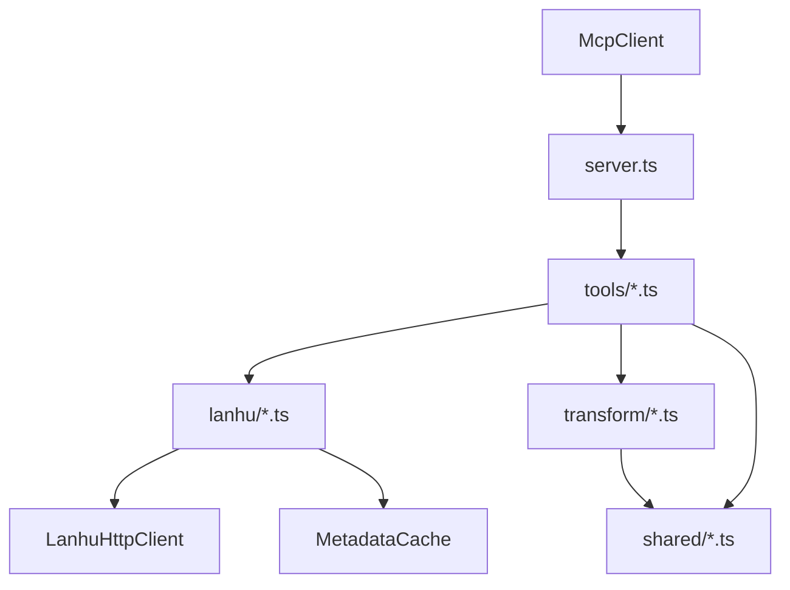

# TS 全仓重写记录

## 目标
- 将当前 Python 单文件实现重构为可维护的 TypeScript 多模块工程。
- 保持现有关键链路不退化：设计稿单图提取、设计稿分析、原型页静态提取、邀请链接 HTTP 解析。
- 覆盖全仓外围：配置、脚本、Docker、测试、文档。

## 当前基线
- 核心服务集中在 `lanhu_mcp_server.py`。
- 当前 MCP 工具共 6 个：
  - `lanhu_resolve_invite_link`
  - `lanhu_list_pages`
  - `lanhu_analyze_pages`
  - `lanhu_list_designs`
  - `lanhu_analyze_designs`
  - `lanhu_get_slices`
- 当前已经移除浏览器运行时依赖，设计稿与原型页都走 HTTP/静态解析链路。

## 重写范围
- 服务层：MCP server、配置加载、错误处理、缓存读写。
- 蓝湖接入层：文档详情、页面列表、资源下载、设计稿列表、DDS schema、Sketch JSON、切图。
- 转换层：Schema 转 HTML/CSS、Sketch token 提取、布局摘要、原型页静态提取。
- 外围：`Dockerfile`、`requirements.txt` 对应的 Node 依赖、安装脚本、README、中英文文档、测试。

## 目标目录
```text
lanhu-mcp/
├── src/
│   ├── server.ts
│   ├── config.ts
│   ├── shared/
│   │   ├── errors.ts
│   │   ├── fs.ts
│   │   ├── html.ts
│   │   └── types.ts
│   ├── lanhu/
│   │   ├── client.ts
│   │   ├── pages.ts
│   │   └── designs.ts
│   ├── transform/
│   │   └── page-static-extractor.ts
│   └── tools/
│       ├── resolve-invite.ts
│       ├── list-pages.ts
│       ├── analyze-pages.ts
│       ├── list-designs.ts
│       ├── analyze-designs.ts
│       └── get-slices.ts
├── tests/
├── tests-ts/
├── package.json
├── tsconfig.json
└── README.md
```

## 建议技术栈
- Node.js 20+
- TypeScript strict
- MCP TypeScript SDK
- `undici` 作为 HTTP 客户端
- `cheerio` 解析 HTML
- `vitest` 作为测试框架
- `tsx` + `tsc` 作为开发/构建工具

## 架构拆分


## 迁移阶段
### 阶段 1：服务骨架与最小链路
- 初始化 TS 工程、配置管理、统一错误模型。
- 先实现 `detailDetach -> /api/project/image -> XDCover` 单图提取。
- 完成 `lanhu_resolve_invite_link`、`lanhu_list_designs`、设计稿单图下载最小闭环。

### 阶段 2：设计稿能力迁移
- 迁移 `get_design_schema_json` 和 `get_sketch_json`。
- 迁移 `convert_lanhu_to_html`、`_extract_layout_from_schema`、`_extract_design_tokens`。
- 迁移 `lanhu_analyze_designs` 与 `lanhu_get_slices`。

### 阶段 3：原型页能力迁移
- 迁移 `get_pages_list`、`download_resources`。
- 迁移 `_extract_page_content_from_html` 和 `screenshot_page_internal` 的静态提取逻辑。
- 迁移 `lanhu_list_pages`、`lanhu_analyze_pages`。

### 阶段 4：外围收口
- 迁移 Docker、脚本、配置样例与 README。
- 建立 Python/TS 关键字段对照测试。
- 形成切换与回退方案。

## 关键实现约束
- 不重新引入浏览器依赖。
- 先兼容现有 MCP 工具签名，再考虑接口优化。
- 先保持返回结构稳定，再逐步收敛到更清晰的 TS 类型。
- 所有蓝湖响应先经过显式类型守卫，避免直接信任第三方字段。

## 输出文档
- [模块映射清单](./ts-rewrite/MODULE_MAPPING.md)
- [兼容矩阵](./ts-rewrite/COMPATIBILITY_MATRIX.md)
- [验收清单](./ts-rewrite/ACCEPTANCE_CHECKLIST.md)
- [切换与回退说明](./ts-rewrite/CUTOVER_AND_ROLLBACK.md)

## 当前结论
- 这次重写更偏向“可维护性提升”，不是“运行时性能翻倍”。
- 最适合的路径不是一次性替换，而是按链路分阶段迁移，并保留 Python 作为短期对照基线。
